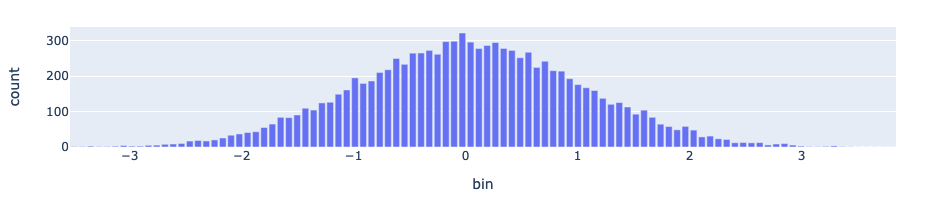

Get Started
============

First create a compressed representation of a distribution:

.. code:: python

    import numpy as np
    import distogram

    distribution = np.random.normal(size=10000)

    # Create and feed distogram from distribution
    # on a real usage, data comes from an event stream
    h = distogram.Distogram()
    for i in distribution:
        h = distogram.update(h, i)

Compute statistics on the distribution:

.. code:: python

    nmin, nmax = distogram.bounds(h)
    print("count: {}".format(distogram.count(h)))
    print("mean: {}".format(distogram.mean(h)))
    print("stddev: {}".format(distogram.stddev(h)))
    print("min: {}".format(nmin))
    print("5%: {}".format(distogram.quantile(h, 0.05)))
    print("25%: {}".format(distogram.quantile(h, 0.25)))
    print("50%: {}".format(distogram.quantile(h, 0.50)))
    print("75%: {}".format(distogram.quantile(h, 0.75)))
    print("95%: {}".format(distogram.quantile(h, 0.95)))
    print("max: {}".format(nmax))

.. code:: console

    count: 10000
    mean: -0.005082954640481095
    stddev: 1.0028524290149186
    min: -3.5691130319855047
    5%: -1.6597242392338374
    25%: -0.6785107421744653
    50%: -0.008672960012168916
    75%: 0.6720718926935414
    95%: 1.6476822301131866
    max: 3.8800560034877427

Compute and display the histogram of the distribution:

.. code:: python

    hist = distogram.histogram(h)
    df_hist = pd.DataFrame(np.array(hist), columns=["bin", "count"])
    fig = px.bar(df_hist, x="bin", y="count", title="distogram")
    fig.update_layout(height=300)
    fig.show()

